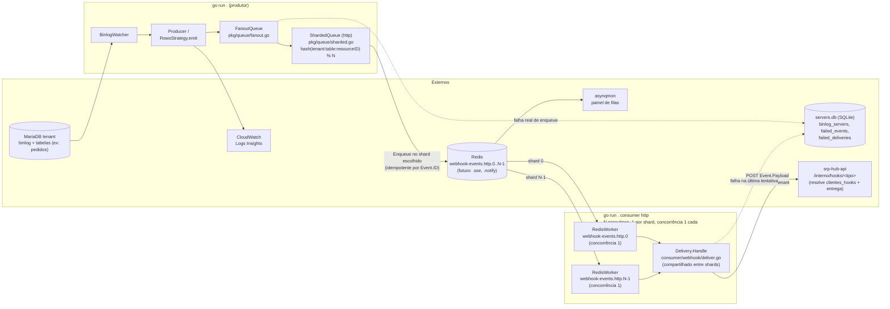

# Webhook Watcher

Watcher de binlog do MariaDB em Go que transforma alterações de linhas em eventos de webhook.

O programa se conecta como um **replicador** ao MariaDB, lê o binlog em tempo real e, para cada `UPDATE` em tabela com `TableProcessor` registrado, extrai o recurso afetado, enriquece via queries e **enfileira o evento no Redis** (asynq) — com fan-out para uma fila por tipo de consumidor e sharding por recurso, para preservar ordem de entrega. Um **consumer HTTP** (`go run . consumer http`) já existe e repassa esse evento para a rota interna de webhooks do `srp-hub-api` (`/interno/hooks/<tipo>`), que faz a resolução de destino por cliente e a entrega final; outros tipos de consumidor (SSE, notificações) são plugáveis pelo mesmo mecanismo, mas ainda não implementados (ver [Próximos passos](#próximos-passos)).

## Como funciona

1. `config.InitDB()` abre/cria o SQLite (`servers.db` por padrão, configurável via `SQLITE_PATH`) e garante o esquema (`binlog_servers`, `failed_events`, `failed_deliveries`). Se não houver servidores cadastrados, um servidor padrão é semeado a partir do `.env` (ou valores de desenvolvimento).
2. `config.LoadServersFromDB()` carrega os servidores ativos (`is_active = 1`).
3. Uma **goroutine por servidor** roda `BinlogWatcher.Start()`. Se o servidor já tem uma posição salva em `binlog_servers` (`binlog_file`/`binlog_pos`), o stream **retoma exatamente daquele ponto**; na primeira execução (posição vazia), consulta `SHOW MASTER STATUS` e começa a partir da posição atual do master. A posição é persistida periodicamente (a cada rotação de binlog, a cada 5s de avanço, e ao encerrar), garantindo resume-on-restart por servidor.
4. Em um loop, cada evento do binlog é roteado pelo `Producer` para a **estratégia** correspondente ao tipo de evento.
5. Para `UPDATE`, as linhas chegam em pares old/new. Apenas tabelas com `TableProcessor` registrado (ex: `pedidos`) geram eventos: a linha nova é enriquecida com queries no MariaDB e vira o payload do evento, com um ID único.
6. O evento é **enfileirado** via `queue.Enqueuer` — um `FanoutQueue` publica em uma fila por tipo de consumidor (hoje só `webhook-events.http`), e dentro do tipo HTTP um `ShardedQueue` roteia por hash de `tenant:table:resourceID` para um entre N shards, preservando a ordem de entrega por recurso — e também logado em JSON (campo `evento`).
7. Do outro lado, `go run . consumer http` consome cada shard (um `RedisWorker` por shard, concorrência 1) e repassa o payload do evento (`{tipoModificacao, recurso}`) via HTTP POST para `<SRP_HUB_API_BASE_URL>/interno/hooks/<tipo>` — é o `srp-hub-api` quem resolve os destinos por cliente e faz a entrega final.

## Logs estruturados (CloudWatch)

Todos os logs são **JSON estruturado** via `slog`, uma linha por registro, com `time`, `level`, `msg` e atributos pesquisáveis — ideal para CloudWatch Logs Insights:

```json
{"time":"2026-08-02T01:37:19.029Z","level":"INFO","msg":"Evento processado","server_id":"DB01","evento":{"id":"evt_ab12cd34...","tenant":"meu_tenant","table":"pedidos","action":"UPDATE","timestamp":1780000000,"payload":{"tipoModificacao":"M","recurso":{...}}}}
```

> O log é a **observabilidade** — o caminho principal de cada evento é a **fila** (Redis), não o stdout. Quem lê a fila e repassa o webhook é o `consumer http` (ver [Como rodar](#como-rodar)).

Exemplos de consultas:

```sql
-- eventos de um servidor específico
filter server_id = 'DB01'
-- erros
filter level = 'ERROR'
-- posições de binlog
filter msg like /binlog/
```

O log `create BinlogSyncer` da go-mysql (config não serializável) é descartado pelo `dropMessageHandler`.

## Eventos descartados (dead-letter)

Dois pontos de dead-letter simétricos, um por lado do pipeline — nenhum evento é perdido silenciosamente, mas também não há retry/reprocessamento automático em nenhum dos dois; a intervenção é manual em ambos.

**Lado producer** — se o enqueue no Redis falhar (ex: Redis indisponível), o evento é salvo na tabela `failed_events` do SQLite (`servers.db`) com o erro correspondente:

```bash
go run . failed-events list                  # lista os mais recentes
go run . failed-events list -server-id DB01  # filtra por servidor
go run . failed-events remove -id 7          # remove após investigar
```

**Lado consumer** — se o repasse para `srp-hub-api` falhar em todas as tentativas do asynq (`asynq.MaxRetry`), a falha é salva na tabela `failed_deliveries` do mesmo SQLite:

```bash
go run . failed-deliveries list                    # lista as mais recentes
go run . failed-deliveries list -tenant meu_tenant # filtra por tenant
go run . failed-deliveries remove -id 3            # remove após investigar
```

O payload completo não aparece no `list` de nenhuma das duas tabelas (ficaria ilegível na tabela); para inspecioná-lo, consulte direto: `sqlite3 servers.db "SELECT payload FROM failed_events WHERE id = 7"` (ou `failed_deliveries`).

## System design

Dois binários (mesmo executável, subcomandos diferentes) rodando como processos independentes, comunicando via Redis; o consumer fala com o `srp-hub-api` por HTTP:



Fluxo resumido: `main.go` carrega os servidores do SQLite (semeando do `.env` quando vazio), dispara uma goroutine por servidor que replica o binlog do MariaDB retomando da última posição persistida para aquele servidor (ou da posição atual via `SHOW MASTER STATUS` na primeira execução), o `Producer` roteia cada evento para a estratégia do tipo (`UPDATE`), e a estratégia despacha para o `TableProcessor` registrado (com enriquecimento via queries no MariaDB). Tabelas sem processor não geram evento. Cada watcher também persiste sua posição de leitura de volta no SQLite (a cada rotação de binlog, a cada ~5s de avanço, e ao encerrar via SIGINT/SIGTERM), permitindo retomar exatamente do ponto onde parou em um restart.

**Produção de eventos para a fila (caminho principal):** para cada UPDATE em uma tabela monitorada, o producer monta o envelope (`queue.Event` com ID único) + payload enriquecido e faz `Enqueue` via `queue.Enqueuer` → `FanoutQueue` → `ShardedQueue` (fila `webhook-events.http.<N>`) → Redis. O enqueue é **idempotente** por fila (`TaskID` = `Event.ID`). O log JSON para o stdout/CloudWatch é apenas observabilidade — o caminho real é a fila.

**Consumo e repasse (`go run . consumer http`):** um processo separado, com uma goroutine por shard, cada uma com seu próprio `RedisWorker` escutando `webhook-events.http.<shard>` em concorrência 1 — é essa concorrência 1 por shard, não o hash em si, que preserva a ordem das **nossas** chamadas por recurso (`tenant:table:resourceID` sempre cai no mesmo shard; shards diferentes processam em paralelo). `N` (`HTTP_CONSUMER_SHARDS`) **precisa ser o mesmo valor** nos dois processos — um valor divergente faz eventos roteados para um shard "extra" ficarem parados sem erro visível. Não há mais resolução de destino própria: `Delivery.Handle` só traduz `Event.Table` para o segmento `<tipo>` da rota e faz `POST` do `Event.Payload` (já `{tipoModificacao, recurso}`) para `<SRP_HUB_API_BASE_URL>/interno/hooks/<tipo>`, com `Authorization`/`tenant` nos headers — quem resolve `clientes_hooks`/`cliente` e entrega pro cliente final é o `srp-hub-api`. Falha nessa chamada aciona o retry/backoff do próprio asynq; na última tentativa, também é gravada em `failed_deliveries`.

**Importante — a ordem só é garantida até essa chamada, não até o cliente final**: a rota `/interno/hooks/<tipo>` do `srp-hub-api` responde antes de terminar seu próprio fan-out para o cliente. Duas chamadas nossas em sequência (garantidamente em ordem, por causa da concorrência 1) podem disparar dois envios internos do `srp-hub-api` que rodam em paralelo do lado de lá e terminam fora de ordem no cliente final. Essa fragilidade já existe hoje naquela rota, independente de quem a chama — não é algo que este consumer introduz, é algo que ele herda ao repassar por ali. Ver [Relação com srp-hub-api](#relação-com-srp-hub-api).

Ver [Extensibilidade](#extensibilidade-plugando-um-novo-tipo-de-consumidor) para como um novo tipo de consumidor (SSE, notificações) se conecta a esse mesmo desenho.

## Arquitetura

```
main.go → config.InitDB() + LoadServersFromDB() → goroutine por servidor
  → BinlogWatcher.Start() (binlog.go) → Producer.HandleEvent() (producer/)
    → EventStrategy (Strategy + Registry) → UpdateRowsStrategy → RowsStrategy
      → FanoutQueue → ShardedQueue (pkg/queue/) → Redis
        → consumer_cmd.go (go run . consumer http) → consumer/webhook/ → srp-hub-api
```

- **`main.go`** — entrypoint e wiring: inicializa o SQLite, carrega os servidores, dispara uma goroutine por servidor e aguarda com `sync.WaitGroup`. Erros de um servidor são logados sem derrubar os demais. Trata `SIGINT`/`SIGTERM` cancelando um `context.Context` compartilhado, dando a cada watcher a chance de persistir a posição final antes de encerrar.
- **`binlog.go`** — conexão de replicação com o go-mysql, resume da posição salva (ou `SHOW MASTER STATUS` na primeira vez, via `decideStartPosition`), loop de eventos, tratamento de `RotateEvent` e persistência periódica da posição (`BinlogWatcher.persistPosition`, a cada rotação/~5s/encerramento). Todas as mensagens levam o prefixo `[server_id]`.
- **`config/`** — `ServerConfig` (credenciais + `ReplicaID` do binlog + `BinlogFile`/`BinlogPos`), `InitDB` (cria o schema e migra `servers.db` antigos adicionando `binlog_file`/`binlog_pos` via `ALTER TABLE`, sem perder dados), `LoadServersFromDB`, `UpdateBinlogPosition`, `DefaultServerConfig` (servidor de seed) e `SaveFailedEvent`/`SaveFailedDelivery` (dead-letter dos dois lados). Driver SQLite CGO-free (`modernc.org/sqlite`).
- **`producer/`** — `Producer` com um registro `map[EventType]EventStrategy`. Adicionar novo tipo de evento = nova estratégia + entrada no mapa, sem tocar no dispatcher. `UpdateRowsStrategy` (update.go) trata UPDATE v1/v2 + compactado MariaDB e reutiliza a base `RowsStrategy` (rows.go): `eachRow` itera os pares old/new, `rowResourceID` extrai o id da coluna 0 (int32/uint32) e `emit` enfileira o evento via `queue.Enqueuer`. **Apenas tabelas com `TableProcessor` registrado geram eventos** — as demais são logadas em Debug.
- **`pkg/queue/`** — port de fila (Ports & Adapters): `Enqueuer` (Enqueue/Close), envelope `Event` (agora com `ResourceID`) e `MemoryQueue` para testes. `RedisQueue` é o adapter Redis via **asynq**, parametrizado por nome de fila, usando `Event.ID` como `TaskID` para **enqueue idempotente por fila** (`ErrDuplicate`); `RedisWorker`, também parametrizado por fila, é o lado consumer (handler tipado com retry/backoff/DLQ gerenciados pelo asynq). `FanoutQueue` (fanout.go) publica em uma fila por tipo de consumidor; `ShardedQueue` (sharded.go) roteia (não replica) por hash de `tenant:table:resourceID` entre N sub-filas, preservando ordem por recurso quando o consumer daquele shard roda com concorrência 1.
- **`consumer/webhook/`** — o consumer HTTP: `Delivery` (deliver.go) é o `queue.Handler` que traduz `Event.Table` para o `<tipo>` da rota via `tableToTipo`, faz o `POST` para `srp-hub-api`, e grava em `failed_deliveries` na última tentativa. Não tem estado nem conexão de banco própria — é só um repassador HTTP.

**Evento gerado** (envelope da fila, logado como `evento`):

```json
{
  "id": "evt_ab12cd34...",
  "tenant": "meu_tenant",
  "table": "pedidos",
  "action": "UPDATE",
  "timestamp": 1780000000,
  "resource_id": 123,
  "payload": {
    "tipoModificacao": "M",
    "recurso": { "id": 123, "codigo": "PED-00123", "status": 1, "...": "campos do pedido" }
  }
}
```

O ID é `evt_` + SHA-256 (16 bytes hex) sobre `binlogFile:logPos:rowIndex:tenant:table:resourceID`. `resource_id` é o mesmo id usado (junto com `tenant`/`table`) para escolher o shard de entrega — repetido no envelope porque `ShardedQueue` não abre o `payload` (que é específico de cada tabela) para descobri-lo.

**O que o consumer HTTP realmente envia** não é esse envelope inteiro — é só o campo `payload` (`{tipoModificacao, recurso}`), como corpo de `POST <SRP_HUB_API_BASE_URL>/interno/hooks/pedidos`, com `Authorization: <SRP_HUB_API_TOKEN>` (valor cru, sem `Bearer`) e `tenant: meu_tenant` nos headers — é exatamente a forma que aquela rota já espera (`src/components/hook/hook.dto.js` do `srp-hub-api`), então o cliente final não vê diferença nenhuma no formato do que recebe.

## Pré-requisitos

- Go 1.26.
- MariaDB acessível a partir da máquina onde o watcher roda, com **binlog habilitado**:

```ini
# my.cnf
[mysqld]
log-bin=mysql-bin
binlog_row_image=FULL   # necessário se dados antigos importarem
server-id=1
```

- Um usuário com privilégios de replicação e acesso a `SHOW MASTER STATUS`:

```sql
CREATE USER 'watcher'@'%' IDENTIFIED BY 'senha';
GRANT REPLICATION SLAVE, REPLICATION CLIENT ON *.* TO 'watcher'@'%';
```

O binlog começa a ser lido da posição atual em `SHOW MASTER STATUS`; se o binlog estiver desabilitado, o watcher falha com erro explícito.

## Configuração

Os servidores a escutar ficam cadastrados na tabela `binlog_servers` do SQLite (arquivo `servers.db` na raiz, configurável via env `SQLITE_PATH`). Na primeira execução, se a tabela estiver vazia, é criado um servidor padrão cujas credenciais vêm de variáveis de ambiente — carregadas do arquivo `.env` na raiz (veja `.env.example`) quando existir, com os valores de desenvolvimento como fallback:

```ini
# .env
SERVER_ID=DB01
REPLICA_ID=100
DB_HOST=localhost
DB_PORT=3306
DB_USER=root
DB_PASSWORD=kodejifr
DB_FLAVOR=mariadb
REDIS_ADDR=localhost:5000
HTTP_CONSUMER_SHARDS=16

# Usado só pelo "consumer http" — ver "Comandos do consumer" abaixo.
SRP_HUB_API_BASE_URL=
SRP_HUB_API_TOKEN=
```

`HTTP_CONSUMER_SHARDS` precisa ser o **mesmo valor** no produtor (`go run .`) e no consumer (`go run . consumer http`) — é um ajuste de paralelismo compartilhado entre os dois processos, não uma credencial, por isso fica em env var (o resto da config sensível deste projeto fica em SQLite, seguindo o padrão de `binlog_servers`, mas `SRP_HUB_API_TOKEN` é um segredo compartilhado com outro sistema, não uma conexão nossa — não há uma linha "nossa" pra gerenciar por CLI, só o valor recebido de quem administra o `srp-hub-api`).

`replica_id` é `UNIQUE` — o ID de réplica do binlog precisa ser único por servidor escutado (dois watchers com o mesmo ID contra o mesmo MariaDB são rejeitados pelo source). Para cadastrar outro servidor, insira na tabela e reinicie:

```sql
INSERT INTO binlog_servers (server_id, replica_id, host, port, user, password, flavor)
VALUES ('DB02', 101, '192.168.1.10', 3306, 'watcher', 'senha', 'mariadb');
```

Para desativar sem apagar: `UPDATE binlog_servers SET is_active = 0 WHERE server_id = 'DB02';`

A tabela também guarda `binlog_file`/`binlog_pos` — a última posição de leitura de cada servidor, atualizada automaticamente pelo watcher (não é necessário preencher ao cadastrar; ficam vazios/zero até a primeira execução). Para forçar um servidor a reler a partir da posição atual do master (ex: recuperação de binlog corrompido/rotacionado), zere manualmente: `UPDATE binlog_servers SET binlog_file = '', binlog_pos = 0 WHERE server_id = 'DB02';`.

## Comandos de servidor

Em vez de editar o SQLite na mão, use o subcomando `server` (não inicia o watcher):

```bash
# adicionar um servidor
go run . server add -id DB02 -replica-id 101 -host 192.168.1.10 -user watcher -password senha -port 3306

# listar servidores cadastrados (inclui inativos)
go run . server list

# atualizar campos informados (só os passados são alterados)
go run . server update -id DB02 -host 192.168.1.11 -port 3307

# desativar um servidor (is_active = 0)
go run . server remove -id DB02
```

O `replica-id` é único: adicionar um servidor com `replica_id` ou `server_id` já existente falha com erro de constraint.

## Comandos do consumer

Com `REDIS_ADDR`, `SRP_HUB_API_BASE_URL` e `SRP_HUB_API_TOKEN` configurados (ver [Configuração](#configuração) e [Relação com srp-hub-api](#relação-com-srp-hub-api) para como obter o token), o consumer HTTP roda como processo próprio:

```bash
go run . consumer http
```

Ele abre uma goroutine por shard (`HTTP_CONSUMER_SHARDS`, default 16 — **precisa bater com o valor usado pelo produtor**), cada uma consumindo `webhook-events.http.<shard>` com concorrência 1, e repassa cada evento para `srp-hub-api` (`/interno/hooks/<tipo>`). É um processo de longa duração, não um subcomando de uma execução só — encerra graciosamente com `SIGINT`/`SIGTERM`.

## Como rodar

O Redis é obrigatório (fila de eventos). Suba a infra e configure `REDIS_ADDR`:

```bash
docker compose up -d          # Redis + asynqmon (http://localhost:8080)
# no .env: REDIS_ADDR=localhost:5000

go build ./...
go vet ./...
go run .
```

Sem `REDIS_ADDR`, o watcher falha na inicialização com instrução para subir o Redis. Em outro terminal, com `SRP_HUB_API_BASE_URL`/`SRP_HUB_API_TOKEN` configurados, suba o consumer:

```bash
go run . consumer http
```

> Use `go build .` ou `go build ./...` para compilar. `go build -o webhook-watcher main.go` compila apenas `main.go` e falha com `undefined: newBinlogWatcher`, pois os demais arquivos do pacote `main` (`binlog.go`, `server_cmd.go`, `consumer_cmd.go`, `failed_events_cmd.go`, `failed_deliveries_cmd.go`, `logging.go`) também são `package main`.

### Docker

O `DockerFile` usa o estágio builder com `go build -o webhook-watcher .` e produz uma imagem `alpine` final enxuta:

```bash
docker build -f DockerFile -t webhook-watcher .
```

## Estrutura do projeto

```
.
├── .env.example            # variáveis do servidor padrão + HTTP_CONSUMER_SHARDS + SRP_HUB_API_* (copie para .env)
├── binlog.go               # watcher de binlog (package main)
├── binlog_test.go          # testes de decideStartPosition (resume vs. 1ª execução)
├── docker-compose.yaml     # Redis + asynqmon (infra local de dev)
├── logging.go              # dropMessageHandler (filtra logs não serializáveis)
├── main.go                 # entrypoint (package main), initQueue() monta FanoutQueue+ShardedQueue
├── server_cmd.go           # subcomandos server add/list/update/remove + openDB/httpShardCount
├── consumer_cmd.go         # subcomando consumer http (worker de N shards)
├── failed_events_cmd.go    # subcomandos failed-events list/remove (dead-letter do producer)
├── failed_deliveries_cmd.go # subcomandos failed-deliveries list/remove (dead-letter do consumer)
├── config/config.go        # ServerConfig, InitDB (+ migração), LoadServersFromDB, UpdateBinlogPosition, SaveFailedEvent/SaveFailedDelivery (SQLite)
├── config/config_test.go   # testes de migração/persistência da posição do binlog + dead-letter
├── pkg/queue/queue.go      # port Enqueuer + envelope Event + QueueNameHTTP/QueueNameHTTPShard
├── pkg/queue/redis.go      # adapter RedisQueue (asynq, enqueue idempotente, parametrizado por fila)
├── pkg/queue/redis_consumer.go # RedisWorker (consumer side, parametrizado por fila)
├── pkg/queue/fanout.go     # FanoutQueue (publica em 1 fila por tipo de consumidor)
├── pkg/queue/sharded.go    # ShardedQueue (roteia por hash tenant:table:resourceID)
├── pkg/queue/memory.go     # MemoryQueue (testes)
├── producer/producer.go    # Producer, EventStrategy, registry
├── producer/rows.go        # RowsStrategy (eachRow, rowResourceID, emit)
├── producer/update.go      # UpdateRowsStrategy
├── consumer/webhook/deliver.go     # Delivery.Handle (POST pro srp-hub-api + failed_deliveries)
├── tables/                 # TableProcessor + processors (pedido)
├── servers.db              # SQLite com binlog_servers/failed_events/failed_deliveries (criado na 1ª execução)
└── go.mod                  # go-mysql-org/go-mysql, modernc.org/sqlite, asynq
```

## Extensibilidade: plugando um novo tipo de consumidor

A arquitetura foi desenhada para que um novo tipo de consumidor (ex: SSE, notificações via Slack/e-mail) se conecte ao mesmo fluxo sem tocar no producer. Passo a passo:

1. **`pkg/queue/queue.go`**: uma constante nova, `QueueNameNotify = QueueName + ".notify"` (mesmo padrão de `QueueNameHTTP`). Se esse tipo também precisar de ordem por recurso, reusa `ShardedQueue` (genérico, não é HTTP-específico); se não precisar — a maioria dos casos de notificação tolera entrega fora de ordem — basta uma fila simples.
2. **Pacote novo `consumer/<tipo>/`** (mesmo formato de `consumer/webhook/`): implementa o que for específico daquele canal e expõe um `Handle(ctx, *queue.Event) error`, que já satisfaz `queue.Handler`.
3. **`main.go:initQueue()`**: uma linha a mais na lista de `targets` do `FanoutQueue` — `queue.NewRedisQueue(addr, queue.QueueNameNotify)`. É a **única** mudança do lado produtor; `RowsStrategy.emit`, `UpdateRowsStrategy` e `binlog.go` continuam sem saber que esse consumidor existe, porque só enxergam `Enqueuer` como interface opaca.
4. **`consumer_cmd.go`**: um novo `case "notify": return runNotifyConsumer(rest)` no switch de `runConsumerCommand`, no mesmo formato de `runHTTPConsumer`.
5. **Operacionalmente independente**: `go run . consumer notify` sobe/cai como processo separado do `consumer http` e do produtor — o único acoplamento entre eles é o Redis como caixa de correio.

Nada em `queue.Event`, nas interfaces `Enqueuer`/`Handler`, em `FanoutQueue`, ou em `producer/`/`binlog.go` precisa mudar para isso.

## Relação com `srp-hub-api`

O `srp-hub-api` (repositório irmão) já tem a rota `/interno/hooks/pedidos|clientes` que resolve `clientes_hooks`/`cliente` (`hub_<ambiente>`) e faz a entrega final ao cliente. Em vez de duplicar essa resolução aqui (que exigiria ler tabelas de outro projeto), o consumer HTTP deste repositório **repassa** cada evento pra essa rota — decisão tomada depois de comparar os dois sistemas e confirmar (no código-fonte de lá) que o payload que ela espera (`{tipoModificacao, recurso}`) é exatamente o que já temos em `Event.Payload`, sem precisar reformatar nada.

**Como funciona a chamada:**
- `POST <SRP_HUB_API_BASE_URL>/interno/hooks/<tipo>` — `<tipo>` vem de `tableToTipo` (hoje só `pedidos`).
- Header `Authorization: <SRP_HUB_API_TOKEN>` — valor **cru**, sem prefixo `Bearer`; comparado literalmente contra a coluna `token` (descriptografada) de uma linha em `cliente_hub_autenticacao`, no banco do `srp-hub-api`.
- Header `tenant: <tenant>` — o nome do tenant (schema), igual ao que já usamos em `Event.Tenant`.
- Corpo: `Event.Payload` como está, sem reformatar.

**Estado atual (projeto ainda em desenvolvimento):**

- **Duplicidade — resolvida por planejamento.** A rota `/interno/hooks/<tipo>` é chamada hoje por um **sistema legado "SRP"** (não é o `hub-events`, isso foi uma suposição inicial errada — `hub-events` chama uma rota completamente diferente, `/interno/queue/hooks`, sem relação com entrega de webhook). Esse sistema legado deixará de enviar quando este projeto for pra produção — combinado, não é mais um risco em aberto, só não pode haver sobreposição entre "SRP legado desligado" e "este consumer ligado" no momento do corte.
- **Ordem não sobrevive à borda** (continua valendo, é característica da rota, não algo a "resolver"). Como já dito em [System design](#system-design): a rota responde antes de terminar seu próprio fan-out, então a ordem de entrega no cliente final não é garantida além do que este consumer controla.

**Ainda pendente, fora deste repositório:**

- **Credencial.** `SRP_HUB_API_TOKEN` (env var, `.env`/`.env.example`) precisa de uma linha **nova** em `cliente_hub_autenticacao`, com `tenant='srp'` (é o que o middleware de auth de lá exige pra liberar `/interno/hooks/*` — não dá pra usar outro valor) mas um **token próprio**, diferente do usado pelo sistema legado que já chama essa rota, com `rate_limit` dimensionado pro volume esperado (lá, o rate limit é por token, não por tenant). Só quem administra esse banco consegue provisionar — não tem valor de desenvolvimento default.

## Próximos passos

- **SSE e notificações**: a arquitetura pluggable existe (ver seção anterior), mas nenhum consumer concreto desses tipos foi implementado ainda — só o HTTP.
- **Obter a credencial dedicada** listada em [Relação com srp-hub-api](#relação-com-srp-hub-api) antes de rodar contra produção — a coordenação de duplicidade com o sistema legado já está combinada (desliga ao ir pra produção), só falta o token em si.
- **Cobertura de recurso**: `srp-hub-api` também valida `clientes` (criado/modificado/deletado) e, para `pedidos`, só aceita `tipoModificacao` `C`/`M` (sem `D`) — relevante quando INSERT/DELETE ou um `TableProcessor` de `clientes` forem adicionados aqui.
- **Novos tipos de evento**: INSERT/DELETE (reutilizando `RowsStrategy` com stride/offset próprios, na mesma linha do UPDATE).
- **Enriquecimento no consumer**: hoje o enriquecimento (queries no MariaDB) acontece no producer, antes do enqueue; mover pro consumer é opcional.
