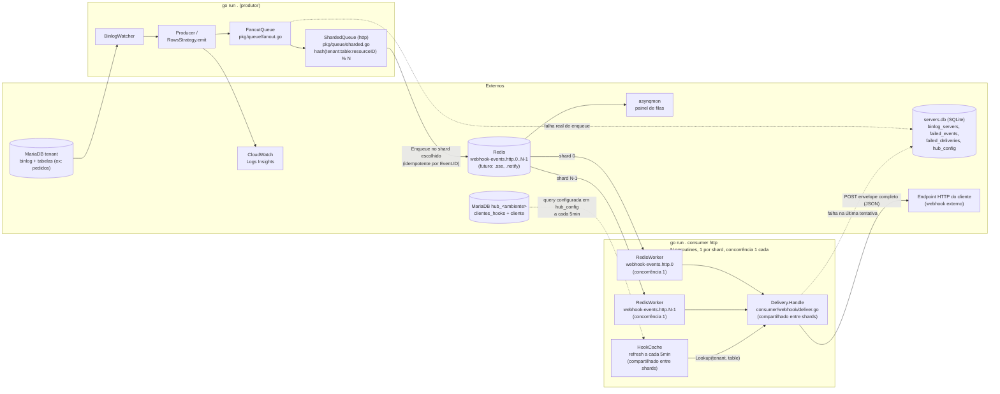

# Webhook Watcher

Watcher de binlog do MariaDB em Go que transforma alterações de linhas em eventos de webhook.

O programa se conecta como um **replicador** ao MariaDB, lê o binlog em tempo real e, para cada `UPDATE` em tabela com `TableProcessor` registrado, extrai o recurso afetado, enriquece via queries e **enfileira o evento no Redis** (asynq) — com fan-out para uma fila por tipo de consumidor e sharding por recurso, para preservar ordem de entrega. Um **consumer HTTP** (`go run . consumer http`) já existe e entrega esse evento como webhook para os destinos cadastrados pelo cliente; outros tipos de consumidor (SSE, notificações) são plugáveis pelo mesmo mecanismo, mas ainda não implementados (ver [Próximos passos](#próximos-passos)).

## Como funciona

1. `config.InitDB()` abre/cria o SQLite (`servers.db` por padrão, configurável via `SQLITE_PATH`) e garante o esquema (`binlog_servers`, `failed_events`, `failed_deliveries`, `hub_config`). Se não houver servidores cadastrados, um servidor padrão é semeado a partir do `.env` (ou valores de desenvolvimento).
2. `config.LoadServersFromDB()` carrega os servidores ativos (`is_active = 1`).
3. Uma **goroutine por servidor** roda `BinlogWatcher.Start()`. Se o servidor já tem uma posição salva em `binlog_servers` (`binlog_file`/`binlog_pos`), o stream **retoma exatamente daquele ponto**; na primeira execução (posição vazia), consulta `SHOW MASTER STATUS` e começa a partir da posição atual do master. A posição é persistida periodicamente (a cada rotação de binlog, a cada 5s de avanço, e ao encerrar), garantindo resume-on-restart por servidor.
4. Em um loop, cada evento do binlog é roteado pelo `Producer` para a **estratégia** correspondente ao tipo de evento.
5. Para `UPDATE`, as linhas chegam em pares old/new. Apenas tabelas com `TableProcessor` registrado (ex: `pedidos`) geram eventos: a linha nova é enriquecida com queries no MariaDB e vira o payload do evento, com um ID único.
6. O evento é **enfileirado** via `queue.Enqueuer` — um `FanoutQueue` publica em uma fila por tipo de consumidor (hoje só `webhook-events.http`), e dentro do tipo HTTP um `ShardedQueue` roteia por hash de `tenant:table:resourceID` para um entre N shards, preservando a ordem de entrega por recurso — e também logado em JSON (campo `evento`).
7. Do outro lado, `go run . consumer http` consome cada shard (um `RedisWorker` por shard, concorrência 1) e entrega o evento via HTTP POST para as URLs cadastradas para aquele tenant/tipo de recurso, resolvidas por um cache em memória atualizado a cada 5 minutos a partir do MariaDB do hub.

## Logs estruturados (CloudWatch)

Todos os logs são **JSON estruturado** via `slog`, uma linha por registro, com `time`, `level`, `msg` e atributos pesquisáveis — ideal para CloudWatch Logs Insights:

```json
{"time":"2026-08-02T01:37:19.029Z","level":"INFO","msg":"Evento processado","server_id":"DB01","evento":{"id":"evt_ab12cd34...","tenant":"meu_tenant","table":"pedidos","action":"UPDATE","timestamp":1780000000,"payload":{"tipoModificacao":"M","recurso":{...}}}}
```

> O log é a **observabilidade** — o caminho principal de cada evento é a **fila** (Redis), não o stdout. Quem lê a fila e dispara o webhook é o `consumer http` (ver [Comandos do hub e do consumer](#comandos-do-hub-e-do-consumer)).

Exemplos de consultas:

```sql
-- eventos de um servidor específico
filter server_id = 'DB01'
-- erros
filter level = 'ERROR'
-- posições de binlog
filter msg like /binlog/
```

O log `create BinlogSyncer` da go-mysql (config não serializável) é descartado pelo `dropMessageHandler`.

## Eventos descartados (dead-letter)

Dois pontos de dead-letter simétricos, um por lado do pipeline — nenhum evento é perdido silenciosamente, mas também não há retry/reprocessamento automático em nenhum dos dois; a intervenção é manual em ambos.

**Lado producer** — se o enqueue no Redis falhar (ex: Redis indisponível), o evento é salvo na tabela `failed_events` do SQLite (`servers.db`) com o erro correspondente:

```bash
go run . failed-events list                  # lista os mais recentes
go run . failed-events list -server-id DB01  # filtra por servidor
go run . failed-events remove -id 7          # remove após investigar
```

**Lado consumer** — se a entrega HTTP falhar em todas as tentativas do asynq (`asynq.MaxRetry`), a URL que falhou é salva na tabela `failed_deliveries` do mesmo SQLite:

```bash
go run . failed-deliveries list                    # lista as mais recentes
go run . failed-deliveries list -tenant meu_tenant # filtra por tenant
go run . failed-deliveries remove -id 3            # remove após investigar
```

O payload completo não aparece no `list` de nenhuma das duas tabelas (ficaria ilegível na tabela); para inspecioná-lo, consulte direto: `sqlite3 servers.db "SELECT payload FROM failed_events WHERE id = 7"` (ou `failed_deliveries`).

## System design

Dois binários (mesmo executável, subcomandos diferentes) rodando como processos independentes, comunicando só via Redis — nenhum dos dois conhece o outro diretamente:



Fluxo resumido: `main.go` carrega os servidores do SQLite (semeando do `.env` quando vazio), dispara uma goroutine por servidor que replica o binlog do MariaDB retomando da última posição persistida para aquele servidor (ou da posição atual via `SHOW MASTER STATUS` na primeira execução), o `Producer` roteia cada evento para a estratégia do tipo (`UPDATE`), e a estratégia despacha para o `TableProcessor` registrado (com enriquecimento via queries no MariaDB). Tabelas sem processor não geram evento. Cada watcher também persiste sua posição de leitura de volta no SQLite (a cada rotação de binlog, a cada ~5s de avanço, e ao encerrar via SIGINT/SIGTERM), permitindo retomar exatamente do ponto onde parou em um restart.

**Produção de eventos para a fila (caminho principal):** para cada UPDATE em uma tabela monitorada, o producer monta o envelope (`queue.Event` com ID único) + payload enriquecido e faz `Enqueue` via `queue.Enqueuer` → `FanoutQueue` → `ShardedQueue` (fila `webhook-events.http.<N>`) → Redis. O enqueue é **idempotente** por fila (`TaskID` = `Event.ID`). O log JSON para o stdout/CloudWatch é apenas observabilidade — o caminho real é a fila.

**Consumo e entrega (`go run . consumer http`):** um processo separado, com uma goroutine por shard, cada uma com seu próprio `RedisWorker` escutando `webhook-events.http.<shard>` em concorrência 1 — é essa concorrência 1 por shard, não o hash em si, que preserva a ordem de entrega por recurso (`tenant:table:resourceID` sempre cai no mesmo shard; shards diferentes processam em paralelo). `N` (`HTTP_CONSUMER_SHARDS`) **precisa ser o mesmo valor** nos dois processos — um valor divergente faz eventos roteados para um shard "extra" ficarem parados sem erro visível. A resolução de destino usa um cache em memória (`HookCache`), atualizado a cada 5 minutos a partir de uma query configurável (`hub_config.hook_query`, editável via `go run . hub set -query` sem reiniciar o processo) rodada contra o MariaDB do hub (`hub_config`, também em SQLite — não env var, mesmo padrão de `binlog_servers`). Falha de entrega aciona o retry/backoff do próprio asynq; na última tentativa, cada URL que falhou também é gravada em `failed_deliveries`.

Ver [Extensibilidade](#extensibilidade-plugando-um-novo-tipo-de-consumidor) para como um novo tipo de consumidor (SSE, notificações) se conecta a esse mesmo desenho.

## Arquitetura

```
main.go → config.InitDB() + LoadServersFromDB() → goroutine por servidor
  → BinlogWatcher.Start() (binlog.go) → Producer.HandleEvent() (producer/)
    → EventStrategy (Strategy + Registry) → UpdateRowsStrategy → RowsStrategy
      → FanoutQueue → ShardedQueue (pkg/queue/) → Redis
        → consumer_cmd.go (go run . consumer http) → consumer/webhook/
```

- **`main.go`** — entrypoint e wiring: inicializa o SQLite, carrega os servidores, dispara uma goroutine por servidor e aguarda com `sync.WaitGroup`. Erros de um servidor são logados sem derrubar os demais. Trata `SIGINT`/`SIGTERM` cancelando um `context.Context` compartilhado, dando a cada watcher a chance de persistir a posição final antes de encerrar.
- **`binlog.go`** — conexão de replicação com o go-mysql, resume da posição salva (ou `SHOW MASTER STATUS` na primeira vez, via `decideStartPosition`), loop de eventos, tratamento de `RotateEvent` e persistência periódica da posição (`BinlogWatcher.persistPosition`, a cada rotação/~5s/encerramento). Todas as mensagens levam o prefixo `[server_id]`.
- **`config/`** — `ServerConfig` (credenciais + `ReplicaID` do binlog + `BinlogFile`/`BinlogPos`), `InitDB` (cria o schema e migra `servers.db` antigos adicionando `binlog_file`/`binlog_pos` via `ALTER TABLE`, sem perder dados), `LoadServersFromDB`, `UpdateBinlogPosition`, `DefaultServerConfig` (servidor de seed), `SaveFailedEvent`/`SaveFailedDelivery` (dead-letter dos dois lados) e `SaveHubConfig`/`LoadHubConfig`/`DefaultHookQuery` (conexão + query do hub, ver [Comandos do hub e do consumer](#comandos-do-hub-e-do-consumer)). Driver SQLite CGO-free (`modernc.org/sqlite`).
- **`producer/`** — `Producer` com um registro `map[EventType]EventStrategy`. Adicionar novo tipo de evento = nova estratégia + entrada no mapa, sem tocar no dispatcher. `UpdateRowsStrategy` (update.go) trata UPDATE v1/v2 + compactado MariaDB e reutiliza a base `RowsStrategy` (rows.go): `eachRow` itera os pares old/new, `rowResourceID` extrai o id da coluna 0 (int32/uint32) e `emit` enfileira o evento via `queue.Enqueuer`. **Apenas tabelas com `TableProcessor` registrado geram eventos** — as demais são logadas em Debug.
- **`pkg/queue/`** — port de fila (Ports & Adapters): `Enqueuer` (Enqueue/Close), envelope `Event` (agora com `ResourceID`) e `MemoryQueue` para testes. `RedisQueue` é o adapter Redis via **asynq**, parametrizado por nome de fila, usando `Event.ID` como `TaskID` para **enqueue idempotente por fila** (`ErrDuplicate`); `RedisWorker`, também parametrizado por fila, é o lado consumer (handler tipado com retry/backoff/DLQ gerenciados pelo asynq). `FanoutQueue` (fanout.go) publica em uma fila por tipo de consumidor; `ShardedQueue` (sharded.go) roteia (não replica) por hash de `tenant:table:resourceID` entre N sub-filas, preservando ordem por recurso quando o consumer daquele shard roda com concorrência 1.
- **`consumer/webhook/`** — o consumer HTTP: `HookCache` (cache.go) mantém em memória o resultado da query configurada em `hub_config`, atualizada a cada 5 minutos; `Delivery` (deliver.go) é o `queue.Handler` que resolve destinos e faz o POST, com dead-letter em `failed_deliveries` na última tentativa.

**Evento gerado** (envelope da fila, logado como `evento`, e também o corpo JSON enviado ao destino do webhook):

```json
{
  "id": "evt_ab12cd34...",
  "tenant": "meu_tenant",
  "table": "pedidos",
  "action": "UPDATE",
  "timestamp": 1780000000,
  "resource_id": 123,
  "payload": {
    "tipoModificacao": "M",
    "recurso": { "id": 123, "codigo": "PED-00123", "status": 1, "...": "campos do pedido" }
  }
}
```

O ID é `evt_` + SHA-256 (16 bytes hex) sobre `binlogFile:logPos:rowIndex:tenant:table:resourceID`. `resource_id` é o mesmo id usado (junto com `tenant`/`table`) para escolher o shard de entrega — repetido no envelope porque `ShardedQueue` não abre o `payload` (que é específico de cada tabela) para descobri-lo.

## Pré-requisitos

- Go 1.26.
- MariaDB acessível a partir da máquina onde o watcher roda, com **binlog habilitado**:

```ini
# my.cnf
[mysqld]
log-bin=mysql-bin
binlog_row_image=FULL   # necessário se dados antigos importarem
server-id=1
```

- Um usuário com privilégios de replicação e acesso a `SHOW MASTER STATUS`:

```sql
CREATE USER 'watcher'@'%' IDENTIFIED BY 'senha';
GRANT REPLICATION SLAVE, REPLICATION CLIENT ON *.* TO 'watcher'@'%';
```

O binlog começa a ser lido da posição atual em `SHOW MASTER STATUS`; se o binlog estiver desabilitado, o watcher falha com erro explícito.

## Configuração

Os servidores a escutar ficam cadastrados na tabela `binlog_servers` do SQLite (arquivo `servers.db` na raiz, configurável via env `SQLITE_PATH`). Na primeira execução, se a tabela estiver vazia, é criado um servidor padrão cujas credenciais vêm de variáveis de ambiente — carregadas do arquivo `.env` na raiz (veja `.env.example`) quando existir, com os valores de desenvolvimento como fallback:

```ini
# .env
SERVER_ID=DB01
REPLICA_ID=100
DB_HOST=localhost
DB_PORT=3306
DB_USER=root
DB_PASSWORD=kodejifr
DB_FLAVOR=mariadb
REDIS_ADDR=localhost:5000
HTTP_CONSUMER_SHARDS=16
```

`HTTP_CONSUMER_SHARDS` precisa ser o **mesmo valor** no produtor (`go run .`) e no consumer (`go run . consumer http`) — é o único parâmetro do consumer que fica em env var, porque é um ajuste de paralelismo compartilhado entre os dois processos, não uma credencial. A conexão com o MariaDB do hub (destinos de webhook) **não** é env var — fica em `hub_config` (SQLite), configurada via `go run . hub set` (ver [Comandos do hub e do consumer](#comandos-do-hub-e-do-consumer)).

`replica_id` é `UNIQUE` — o ID de réplica do binlog precisa ser único por servidor escutado (dois watchers com o mesmo ID contra o mesmo MariaDB são rejeitados pelo source). Para cadastrar outro servidor, insira na tabela e reinicie:

```sql
INSERT INTO binlog_servers (server_id, replica_id, host, port, user, password, flavor)
VALUES ('DB02', 101, '192.168.1.10', 3306, 'watcher', 'senha', 'mariadb');
```

Para desativar sem apagar: `UPDATE binlog_servers SET is_active = 0 WHERE server_id = 'DB02';`

A tabela também guarda `binlog_file`/`binlog_pos` — a última posição de leitura de cada servidor, atualizada automaticamente pelo watcher (não é necessário preencher ao cadastrar; ficam vazios/zero até a primeira execução). Para forçar um servidor a reler a partir da posição atual do master (ex: recuperação de binlog corrompido/rotacionado), zere manualmente: `UPDATE binlog_servers SET binlog_file = '', binlog_pos = 0 WHERE server_id = 'DB02';`.

## Comandos de servidor

Em vez de editar o SQLite na mão, use o subcomando `server` (não inicia o watcher):

```bash
# adicionar um servidor
go run . server add -id DB02 -replica-id 101 -host 192.168.1.10 -user watcher -password senha -port 3306

# listar servidores cadastrados (inclui inativos)
go run . server list

# atualizar campos informados (só os passados são alterados)
go run . server update -id DB02 -host 192.168.1.11 -port 3307

# desativar um servidor (is_active = 0)
go run . server remove -id DB02
```

O `replica-id` é único: adicionar um servidor com `replica_id` ou `server_id` já existente falha com erro de constraint.

## Comandos do hub e do consumer

A conexão com o MariaDB do hub (schema `hub_<ambiente>`, onde vivem `clientes_hooks`/`cliente` — as tabelas de destino de webhook) e a query usada para resolver esses destinos ficam em `hub_config` (SQLite), gerenciadas pelo subcomando `hub` — mesmo padrão de `server`, nada disso é editado à mão nem via `.env`:

```bash
# configurar a conexão (query é opcional; sem -query usa config.DefaultHookQuery)
go run . hub set -host 192.168.1.10 -port 3306 -user hub_reader -password senha -schema hub_producao

# ver a configuração atual (nunca mostra a senha)
go run . hub show

# rodar a query configurada de verdade e validar a forma da resposta
# (útil antes de subir o consumer, ou depois de editar -query)
go run . hub query
go run . hub query -limit 5
```

`hub query` conecta no hub, roda `hook_query` como está salva, confere se a resposta tem as 3 colunas esperadas (`tenant`, `tipo`, `url`, nessa ordem — case-insensitive) e imprime um resumo (`✓ colunas OK: ...` ou `⚠ esperava ... veio ...`) seguido de uma tabela com o resultado. Não precisa de Redis; funciona mesmo com `clientes_hooks` vazia (mostra "0 linhas" mas já confirma que a conexão e a query estão certas).

Com o hub configurado e o Redis no ar, o consumer HTTP roda como processo próprio:

```bash
go run . consumer http
```

Ele abre uma goroutine por shard (`HTTP_CONSUMER_SHARDS`, default 16 — **precisa bater com o valor usado pelo produtor**), cada uma consumindo `webhook-events.http.<shard>` com concorrência 1 (preserva ordem de entrega por recurso), resolvendo destinos via o cache de 5 minutos e entregando por HTTP POST. É um processo de longa duração, não um subcomando de uma execução só — encerra graciosamente com `SIGINT`/`SIGTERM`.

## Como rodar

O Redis é obrigatório (fila de eventos). Suba a infra e configure `REDIS_ADDR`:

```bash
docker compose up -d          # Redis + asynqmon (http://localhost:8080)
# no .env: REDIS_ADDR=localhost:5000

go build ./...
go vet ./...
go run .
```

Sem `REDIS_ADDR`, o watcher falha na inicialização com instrução para subir o Redis. Em outro terminal, com o hub já configurado (`go run . hub set`), suba o consumer:

```bash
go run . consumer http
```

> Use `go build .` ou `go build ./...` para compilar. `go build -o webhook-watcher main.go` compila apenas `main.go` e falha com `undefined: newBinlogWatcher`, pois os demais arquivos do pacote `main` (`binlog.go`, `server_cmd.go`, `consumer_cmd.go`, `hub_cmd.go`, `failed_events_cmd.go`, `failed_deliveries_cmd.go`, `logging.go`) também são `package main`.

### Docker

O `DockerFile` usa o estágio builder com `go build -o webhook-watcher .` e produz uma imagem `alpine` final enxuta:

```bash
docker build -f DockerFile -t webhook-watcher .
```

## Estrutura do projeto

```
.
├── .env.example            # variáveis do servidor padrão + HTTP_CONSUMER_SHARDS (copie para .env)
├── binlog.go               # watcher de binlog (package main)
├── binlog_test.go          # testes de decideStartPosition (resume vs. 1ª execução)
├── docker-compose.yaml     # Redis + asynqmon (infra local de dev)
├── logging.go              # dropMessageHandler (filtra logs não serializáveis)
├── main.go                 # entrypoint (package main), initQueue() monta FanoutQueue+ShardedQueue
├── server_cmd.go           # subcomandos server add/list/update/remove + openDB/httpShardCount
├── consumer_cmd.go         # subcomando consumer http (worker de N shards)
├── hub_cmd.go               # subcomandos hub set/show/query
├── hub_query_test.go        # teste de checkHookColumns (hub query)
├── failed_events_cmd.go    # subcomandos failed-events list/remove (dead-letter do producer)
├── failed_deliveries_cmd.go # subcomandos failed-deliveries list/remove (dead-letter do consumer)
├── config/config.go        # ServerConfig, InitDB (+ migração), LoadServersFromDB, UpdateBinlogPosition, SaveFailedEvent/SaveFailedDelivery, SaveHubConfig/LoadHubConfig/DefaultHookQuery (SQLite)
├── config/config_test.go   # testes de migração/persistência da posição do binlog + dead-letter + hub_config
├── pkg/queue/queue.go      # port Enqueuer + envelope Event + QueueNameHTTP/QueueNameHTTPShard
├── pkg/queue/redis.go      # adapter RedisQueue (asynq, enqueue idempotente, parametrizado por fila)
├── pkg/queue/redis_consumer.go # RedisWorker (consumer side, parametrizado por fila)
├── pkg/queue/fanout.go     # FanoutQueue (publica em 1 fila por tipo de consumidor)
├── pkg/queue/sharded.go    # ShardedQueue (roteia por hash tenant:table:resourceID)
├── pkg/queue/memory.go     # MemoryQueue (testes)
├── producer/producer.go    # Producer, EventStrategy, registry
├── producer/rows.go        # RowsStrategy (eachRow, rowResourceID, emit)
├── producer/update.go      # UpdateRowsStrategy
├── consumer/webhook/cache.go       # HookCache (cache em memória, refresh a cada 5min)
├── consumer/webhook/cache_query.go # queryHookDestinations (SQL isolado, testável)
├── consumer/webhook/deliver.go     # Delivery.Handle (POST HTTP + failed_deliveries)
├── tables/                 # TableProcessor + processors (pedido)
├── servers.db              # SQLite com binlog_servers/failed_events/failed_deliveries/hub_config (criado na 1ª execução)
└── go.mod                  # go-mysql-org/go-mysql, modernc.org/sqlite, asynq
```

## Extensibilidade: plugando um novo tipo de consumidor

A arquitetura foi desenhada para que um novo tipo de consumidor (ex: SSE, notificações via Slack/e-mail) se conecte ao mesmo fluxo sem tocar no producer. Passo a passo:

1. **`pkg/queue/queue.go`**: uma constante nova, `QueueNameNotify = QueueName + ".notify"` (mesmo padrão de `QueueNameHTTP`). Se esse tipo também precisar de ordem por recurso, reusa `ShardedQueue` (genérico, não é HTTP-específico); se não precisar — a maioria dos casos de notificação tolera entrega fora de ordem — basta uma fila simples.
2. **Pacote novo `consumer/<tipo>/`** (mesmo formato de `consumer/webhook/`): implementa o que for específico daquele canal e expõe um `Handle(ctx, *queue.Event) error`, que já satisfaz `queue.Handler`.
3. **`main.go:initQueue()`**: uma linha a mais na lista de `targets` do `FanoutQueue` — `queue.NewRedisQueue(addr, queue.QueueNameNotify)`. É a **única** mudança do lado produtor; `RowsStrategy.emit`, `UpdateRowsStrategy` e `binlog.go` continuam sem saber que esse consumidor existe, porque só enxergam `Enqueuer` como interface opaca.
4. **`consumer_cmd.go`**: um novo `case "notify": return runNotifyConsumer(rest)` no switch de `runConsumerCommand`, no mesmo formato de `runHTTPConsumer`.
5. **Operacionalmente independente**: `go run . consumer notify` sobe/cai como processo separado do `consumer http` e do produtor — o único acoplamento entre eles é o Redis como caixa de correio.

Nada em `queue.Event`, nas interfaces `Enqueuer`/`Handler`, em `FanoutQueue`, ou em `producer/`/`binlog.go` precisa mudar para isso.

## Relação com `srp-hub-api`

O `srp-hub-api` (repositório irmão) já tem uma rota de entrega de webhook que lê as **mesmas** tabelas `clientes_hooks`/`cliente` (`hub_<ambiente>`) — confirmado no código-fonte de lá (`src/config/constants.js`, `src/components/hook/`). Duas diferenças importantes, levantadas ao comparar os dois sistemas:

- **Gatilho mais frágil do lado de lá**: a entrega de `srp-hub-api` não dispara em cima da escrita no banco — dispara quando outro sistema (o pipeline `hub-events`) chama explicitamente uma rota interna (`/interno/hooks/pedidos|clientes`) depois de já ter escrito o dado. Qualquer mudança que passe por outro caminho (carga em lote, ERP escrevendo direto, um passo do ETL que não chame essa rota) não gera webhook lá. Por ler o binlog, este projeto não tem esse buraco — pega qualquer escrita, independente de quem escreveu.
- **`tipo` confirmado, não mais suposição**: `clientes_hooks.tipo` é `"pedidos"`/`"clientes"` (igual ao nome da tabela, plural, sem tradução) — confirmado contra `src/config/constants.js` do `srp-hub-api`, que é quem escreve/lê essa tabela em produção hoje. `tableToTipo` (`consumer/webhook/cache.go`) já reflete isso.

Isso não significa que dá pra desligar a rota de lá ainda — faltam duas coisas pra ter paridade:

1. **Formato do payload é diferente**: `srp-hub-api` manda `{tipoModificacao, recurso}` puro no corpo; este consumer manda o envelope completo `queue.Event` (`{id, tenant, table, action, timestamp, resource_id, payload: {tipoModificacao, recurso}}`). Um receptor de cliente já feito pra ler o formato antigo quebraria recebendo este sem aviso — é contrato de integração externa, não detalhe interno.
2. **Cobertura de recurso**: `srp-hub-api` cobre `pedidos` (criado/modificado) **e** `clientes` (criado/modificado/deletado); este consumer só cobre `pedidos`/`UPDATE` hoje (ver INSERT/DELETE abaixo).

## Próximos passos

- **SSE e notificações**: a arquitetura pluggable existe (ver seção anterior), mas nenhum consumer concreto desses tipos foi implementado ainda — só o HTTP.
- **Fechar as lacunas com `srp-hub-api`** (ver seção acima) antes de cogitar substituir aquela rota: alinhar formato de payload (ou versionar/negociar por cliente) e cobrir INSERT/DELETE + recurso `clientes`.
- **Autenticação na entrega**: `cliente_hub.acesso` (tabela que não entra no join atual de resolução de destino) provavelmente guarda um token/segredo do destino, mas seu formato/uso nunca foi confirmado — hoje o consumer HTTP não envia nenhum header de autenticação/assinatura (mesma limitação observada em `srp-hub-api`, que também não assina/autentica a entrega).
- **Enriquecimento no consumer**: hoje o enriquecimento (queries no MariaDB) acontece no producer, antes do enqueue; mover para o consumer é opcional.
- **Novos tipos de evento**: INSERT/DELETE (reutilizando `RowsStrategy` com stride/offset próprios, na mesma linha do UPDATE).
- **Retry por destino**: hoje um retry do asynq reenvia a TODOS os destinos configurados para um evento, inclusive os que já tinham recebido com sucesso na tentativa anterior — não há estado de entrega por destino.
