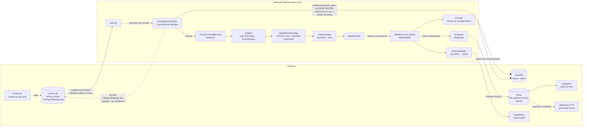

# Webhook Watcher

Watcher de binlog do MariaDB em Go que transforma alterações de linhas em eventos de webhook.

O programa se conecta como um **replicador** ao MariaDB, lê o binlog em tempo real e, para cada `UPDATE` em tabela com `TableProcessor` registrado, extrai o recurso afetado, enriquece via queries e **enfileira o evento no Redis** (asynq). O consumer que monta o webhook e dispara o HTTP está no roadmap (ver [Próximos passos](#próximos-passos)).

## Como funciona

1. `config.InitDB()` abre/cria o SQLite (`servers.db` por padrão, configurável via `SQLITE_PATH`) e garante o esquema `binlog_servers`. Se não houver servidores cadastrados, um servidor padrão é semeado a partir do `.env` (ou valores de desenvolvimento).
2. `config.LoadServersFromDB()` carrega os servidores ativos (`is_active = 1`).
3. Uma **goroutine por servidor** roda `BinlogWatcher.Start()`. Se o servidor já tem uma posição salva em `binlog_servers` (`binlog_file`/`binlog_pos`), o stream **retoma exatamente daquele ponto**; na primeira execução (posição vazia), consulta `SHOW MASTER STATUS` e começa a partir da posição atual do master. A posição é persistida periodicamente (a cada rotação de binlog, a cada 5s de avanço, e ao encerrar), garantindo resume-on-restart por servidor.
4. Em um loop, cada evento do binlog é roteado pelo `Producer` para a **estratégia** correspondente ao tipo de evento.
5. Para `UPDATE`, as linhas chegam em pares old/new. Apenas tabelas com `TableProcessor` registrado (ex: `pedidos`) geram eventos: a linha nova é enriquecida com queries no MariaDB e vira o payload do evento, com um ID único.
6. O evento é **enfileirado** via `queue.Enqueuer` (Redis + asynq, idempotente por `TaskID`) e também logado em JSON (campo `evento`).

## Logs estruturados (CloudWatch)

Todos os logs são **JSON estruturado** via `slog`, uma linha por registro, com `time`, `level`, `msg` e atributos pesquisáveis — ideal para CloudWatch Logs Insights:

```json
{"time":"2026-08-02T01:37:19.029Z","level":"INFO","msg":"Evento processado","server_id":"DB01","evento":{"id":"evt_ab12cd34...","tenant":"meu_tenant","table":"pedidos","action":"UPDATE","timestamp":1780000000,"payload":{"tipoModificacao":"M","recurso":{...}}}}
```

> O log é a **observabilidade** — o caminho principal de cada evento é a **fila** (Redis), não o stdout. O consumer que lerá a fila e disparará o webhook está no roadmap.

Exemplos de consultas:

```sql
-- eventos de um servidor específico
filter server_id = 'DB01'
-- erros
filter level = 'ERROR'
-- posições de binlog
filter msg like /binlog/
```

O log `create BinlogSyncer` da go-mysql (config não serializável) é descartado pelo `dropMessageHandler`.

## System design

Estado atual do projeto — o watcher é um binário Go único que replica o binlog do MariaDB, roteia os eventos para as estratégias registradas, enriquece as tabelas customizadas e **enfileira cada evento no Redis (asynq)**; o mesmo evento também é logado como JSON (CloudWatch). O consumer (montar webhook + HTTP) ainda não existe (ver [Próximos passos](#próximos-passos)).



Fluxo resumido: `main.go` carrega os servidores do SQLite (semeando do `.env` quando vazio), dispara uma goroutine por servidor que replica o binlog do MariaDB retomando da última posição persistida para aquele servidor (ou da posição atual via `SHOW MASTER STATUS` na primeira execução), o `Producer` roteia cada evento para a estratégia do tipo (`UPDATE`), e a estratégia despacha para o `TableProcessor` registrado (com enriquecimento via queries no MariaDB). Tabelas sem processor não geram evento. Cada watcher também persiste sua posição de leitura de volta no SQLite (a cada rotação de binlog, a cada ~5s de avanço, e ao encerrar via SIGINT/SIGTERM), permitindo retomar exatamente do ponto onde parou em um restart.

**Produção de eventos para a fila (caminho principal):** para cada UPDATE em uma tabela monitorada, o producer monta o envelope (`queue.Event` com ID único) + payload enriquecido e faz `Enqueue` via `queue.Enqueuer` (asynq) → Redis. O enqueue é **idempotente** (`TaskID` = `Event.ID`). O consumer que lerá essa fila e disparará o webhook HTTP está no roadmap. O log JSON para o stdout/CloudWatch é apenas observabilidade.

## Arquitetura

```
main.go → config.InitDB() + LoadServersFromDB() → goroutine por servidor
  → BinlogWatcher.Start() (binlog.go) → Producer.HandleEvent() (producer/)
    → EventStrategy (Strategy + Registry) → UpdateRowsStrategy → RowsStrategy
```

- **`main.go`** — entrypoint e wiring: inicializa o SQLite, carrega os servidores, dispara uma goroutine por servidor e aguarda com `sync.WaitGroup`. Erros de um servidor são logados sem derrubar os demais. Trata `SIGINT`/`SIGTERM` cancelando um `context.Context` compartilhado, dando a cada watcher a chance de persistir a posição final antes de encerrar.
- **`binlog.go`** — conexão de replicação com o go-mysql, resume da posição salva (ou `SHOW MASTER STATUS` na primeira vez, via `decideStartPosition`), loop de eventos, tratamento de `RotateEvent` e persistência periódica da posição (`BinlogWatcher.persistPosition`, a cada rotação/~5s/encerramento). Todas as mensagens levam o prefixo `[server_id]`.
- **`config/`** — `ServerConfig` (credenciais + `ReplicaID` do binlog + `BinlogFile`/`BinlogPos`), `InitDB` (cria o schema e migra `servers.db` antigos adicionando `binlog_file`/`binlog_pos` via `ALTER TABLE`, sem perder dados), `LoadServersFromDB`, `UpdateBinlogPosition` e `DefaultServerConfig` (servidor de seed). Driver SQLite CGO-free (`modernc.org/sqlite`).
- **`producer/`** — `Producer` com um registro `map[EventType]EventStrategy`. Adicionar novo tipo de evento = nova estratégia + entrada no mapa, sem tocar no dispatcher. `UpdateRowsStrategy` (update.go) trata UPDATE v1/v2 + compactado MariaDB e reutiliza a base `RowsStrategy` (rows.go): `eachRow` itera os pares old/new, `rowResourceID` extrai o id da coluna 0 (int32/uint32) e `emit` enfileira o evento via `queue.Enqueuer`. **Apenas tabelas com `TableProcessor` registrado geram eventos** — as demais são logadas em Debug.
- **`pkg/queue/`** — port de fila (Ports & Adapters): `Enqueuer` (Enqueue/Close), envelope `Event` e `MemoryQueue` para testes. `RedisQueue` é o adapter Redis via **asynq**, usando `Event.ID` como `TaskID` para **enqueue idempotente** (`ErrDuplicate`); `RedisWorker` é o lado consumer (handler tipado com retry/backoff/DLQ gerenciados pelo asynq).

**Evento gerado** (envelope da fila, logado como `evento`):

```json
{
  "id": "evt_ab12cd34...",
  "tenant": "meu_tenant",
  "table": "pedidos",
  "action": "UPDATE",
  "timestamp": 1780000000,
  "payload": {
    "tipoModificacao": "M",
    "recurso": { "id": 123, "codigo": "PED-00123", "status": 1, "...": "campos do pedido" }
  }
}
```

O ID é `evt_` + SHA-256 (16 bytes hex) sobre `binlogFile:logPos:rowIndex:tenant:table:resourceID`.

## Pré-requisitos

- Go 1.26.
- MariaDB acessível a partir da máquina onde o watcher roda, com **binlog habilitado**:

```ini
# my.cnf
[mysqld]
log-bin=mysql-bin
binlog_row_image=FULL   # necessário se dados antigos importarem
server-id=1
```

- Um usuário com privilégios de replicação e acesso a `SHOW MASTER STATUS`:

```sql
CREATE USER 'watcher'@'%' IDENTIFIED BY 'senha';
GRANT REPLICATION SLAVE, REPLICATION CLIENT ON *.* TO 'watcher'@'%';
```

O binlog começa a ser lido da posição atual em `SHOW MASTER STATUS`; se o binlog estiver desabilitado, o watcher falha com erro explícito.

## Configuração

Os servidores a escutar ficam cadastrados na tabela `binlog_servers` do SQLite (arquivo `servers.db` na raiz, configurável via env `SQLITE_PATH`). Na primeira execução, se a tabela estiver vazia, é criado um servidor padrão cujas credenciais vêm de variáveis de ambiente — carregadas do arquivo `.env` na raiz (veja `.env.example`) quando existir, com os valores de desenvolvimento como fallback:

```ini
# .env
SERVER_ID=DB01
REPLICA_ID=100
DB_HOST=localhost
DB_PORT=3306
DB_USER=root
DB_PASSWORD=kodejifr
DB_FLAVOR=mariadb
REDIS_ADDR=localhost:5000
```

`replica_id` é `UNIQUE` — o ID de réplica do binlog precisa ser único por servidor escutado (dois watchers com o mesmo ID contra o mesmo MariaDB são rejeitados pelo source). Para cadastrar outro servidor, insira na tabela e reinicie:

```sql
INSERT INTO binlog_servers (server_id, replica_id, host, port, user, password, flavor)
VALUES ('DB02', 101, '192.168.1.10', 3306, 'watcher', 'senha', 'mariadb');
```

Para desativar sem apagar: `UPDATE binlog_servers SET is_active = 0 WHERE server_id = 'DB02';`

A tabela também guarda `binlog_file`/`binlog_pos` — a última posição de leitura de cada servidor, atualizada automaticamente pelo watcher (não é necessário preencher ao cadastrar; ficam vazios/zero até a primeira execução). Para forçar um servidor a reler a partir da posição atual do master (ex: recuperação de binlog corrompido/rotacionado), zere manualmente: `UPDATE binlog_servers SET binlog_file = '', binlog_pos = 0 WHERE server_id = 'DB02';`.

## Comandos de servidor

Em vez de editar o SQLite na mão, use o subcomando `server` (não inicia o watcher):

```bash
# adicionar um servidor
go run . server add -id DB02 -replica-id 101 -host 192.168.1.10 -user watcher -password senha -port 3306

# listar servidores cadastrados (inclui inativos)
go run . server list

# atualizar campos informados (só os passados são alterados)
go run . server update -id DB02 -host 192.168.1.11 -port 3307

# desativar um servidor (is_active = 0)
go run . server remove -id DB02
```

O `replica-id` é único: adicionar um servidor com `replica_id` ou `server_id` já existente falha com erro de constraint.

## Como rodar

O Redis é obrigatório (fila de eventos). Suba a infra e configure `REDIS_ADDR`:

```bash
docker compose up -d          # Redis + asynqmon (http://localhost:8080)
# no .env: REDIS_ADDR=localhost:5000

go build ./...
go vet ./...
go run .
```

Sem `REDIS_ADDR`, o watcher falha na inicialização com instrução para subir o Redis.

> Use `go build .` ou `go build ./...` para compilar. `go build -o webhook-watcher main.go` compila apenas `main.go` e falha com `undefined: newBinlogWatcher`, pois `binlog.go` e `producer.go` também são `package main`.

### Docker

O `DockerFile` usa o estágio builder com `go build -o webhook-watcher .` e produz uma imagem `alpine` final enxuta:

```bash
docker build -f DockerFile -t webhook-watcher .
```

## Estrutura do projeto

```
.
├── .env.example            # variáveis do servidor padrão (copie para .env)
├── binlog.go               # watcher de binlog (package main)
├── binlog_test.go          # testes de decideStartPosition (resume vs. 1ª execução)
├── docker-compose.yaml     # Redis + asynqmon (infra local de dev)
├── logging.go              # dropMessageHandler (filtra logs não serializáveis)
├── main.go                 # entrypoint (package main)
├── server_cmd.go           # subcomandos server add/list/update/remove
├── config/config.go        # ServerConfig, InitDB (+ migração), LoadServersFromDB, UpdateBinlogPosition (SQLite)
├── config/config_test.go   # testes de migração/persistência da posição do binlog
├── pkg/queue/queue.go      # port Enqueuer + envelope Event
├── pkg/queue/redis.go      # adapter RedisQueue (asynq, enqueue idempotente)
├── pkg/queue/redis_consumer.go # RedisWorker (consumer side)
├── pkg/queue/memory.go     # MemoryQueue (testes)
├── producer/producer.go    # Producer, EventStrategy, registry
├── producer/rows.go        # RowsStrategy (eachRow, rowResourceID, emit)
├── producer/update.go      # UpdateRowsStrategy
├── tables/                 # TableProcessor + processors (pedido)
├── servers.db              # SQLite com binlog_servers (criado na 1ª execução)
└── go.mod                  # go-mysql-org/go-mysql, modernc.org/sqlite, asynq
```

## Próximos passos

- **Consumer**: a fila já está pronta (Redis + asynq, retry/backoff/dead-letter embutidos). Falta o consumer que:
  1. lê o evento da fila (`RedisWorker.Handle`);
  2. monta o payload do webhook a partir do evento enriquecido;
  3. dispara o request HTTP com retry/backoff.
- **Enriquecimento no consumer**: hoje o enriquecimento (queries no MariaDB) acontece no producer, antes do enqueue; mover para o consumer é opcional.
- **Novos tipos de evento**: INSERT/DELETE (reutilizando `RowsStrategy` com stride/offset próprios, na mesma linha do UPDATE).
